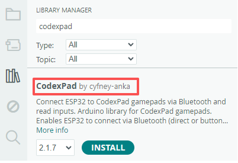
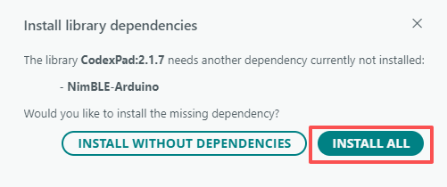

# CodexPad Arduino Lib

[中文](README.zh-CN.md)

## Overview

This library is the **dedicated Arduino platform library** for the **CodexPad** series controllers. It supports ESP32 series development boards in connecting to and reading the input status of all buttons and joysticks on a CodexPad controller via Bluetooth. For detailed information about CodexPad products, please refer to the product documentation below.

| CodexPad Model | Details |
| :--- | :--- |
| CodexPad-C10 | [Product Details](../../../codex_pad_c10/blob/main/README.md#codexpad-c10) |
| CodexPad-S10 | [Product Details](../../../codex_pad_s10/blob/main/README.md#codexpad-s10) |

## Supported Hardware Platforms

| Supported Hardware Platforms |
| :--- |
| ESP32 |
| ESP32-S2 |
| ESP32-S3 |
| ESP32-C3 |
| ESP32-C5 |
| ESP32-C6 |
| ESP32-H2 |
| ESP32-P4 |

## Features

- **Flexible Dual-Mode Connection**:

  - **Direct Connection via Bluetooth Device Address**: Quickly establish a stable connection with a specific controller using a known Bluetooth Device Address.

  - **Button Mask Scan Connection**: Connect without knowing the Bluetooth Device Address in advance. By scanning for and matching a specific combination of buttons held down on the target controller (defined as a "button mask" in your code), the library automatically connects to the device with the strongest signal (highest RSSI), enabling fast and flexible pairing.

- **Real-time Button Event Detection**: Reads the input status of all buttons in real time, distinguishing between **Pressed**, **Released**, and **Holding** events.

- **High-Precision Joystick Data**: Retrieves analog values for the X and Y axes of the left and right joysticks, ranging from 0 to 255, providing precise control input.

- **Adjustable Transmit Power**: Allows dynamic adjustment of the Bluetooth transmit power within a range of **-16 dBm to +6 dBm** based on the application scenario (e.g., distance, power requirements).

## Detailed Explanation of Button Mask Scan Connection

**Button Mask Scan Connection** is a distinctive feature of CodexPad, allowing the host to connect by scanning for and matching a specific combination of buttons held down on the device. This method establishes a physical "handshake" protocol between the device and the host, offering significant advantages in multi-device environments and flexible pairing scenarios.

### Design Intent and Advantages

1. **Preventing Accidental Connections and Interference**: When multiple connectable devices of the same type (e.g., multiple controllers) are nearby, while their unique **Bluetooth Device Address** can be used for precise connection, this typically requires "hardcoding" the address in the code. This approach binds the program to a specific device, lacking flexibility. By requiring the target device to hold a specific button combination while being discovered, a dynamic, condition-based connection rule is defined. Your connection code is not bound to any device's physical address; as long as a device satisfies this "handshake protocol" (holding the correct buttons), it will be connected. This effectively prevents the host from accidentally connecting to the wrong device among multiple devices, while enabling the convenience of **connect on press, with the ability to switch devices at any time**.

2. **Creating Exclusive Connection Conditions**: You can think of this button mask as a simple "password" or "connection token." It creates an exclusive connection channel between your application and the device, allowing only devices that meet this specific physical interaction condition (pressing the designated buttons) to join, enhancing the intentionality and control of the connection.

3. **Improving Code Flexibility, Supporting On-the-Fly Device Switching**: Unlike hardcoding a specific device's Bluetooth Device Address, the connection logic using a button mask is oriented towards a "condition" rather than a "specific device." This means your same set of connection code, without modification, can be used to connect to any controller that is discoverable and correctly triggers the preset button condition. This offers two major conveniences:

    - **No Need to Bind to a Specific Device**: You don't need to specify a controller's address in the code, nor maintain different connection configurations for different controllers.

    - **Connect on Press, Flexible Switching**: In practical use, you can pick up another controller at any time. As long as it is powered on and holding the correct button combination, your program can automatically connect to it, enabling seamless switching between different controllers.

## Usage Instructions

### Preparations

Before starting to program, complete the following preparations to ensure a smooth development process.

### Familiarize Yourself with the Product Documentation

Read the CodexPad product manual in detail to fully understand the hardware features, familiarize yourself with the controller's button/joystick layout, function definitions, indicator light statuses, and power on/off operations.

### Obtain and Record the Controller's Bluetooth Device Address (BD_ADDR)

> ⚠️ Important Note: The direct connection example in this library connects using the Bluetooth Device Address (BD_ADDR). When programming, you must explicitly specify your controller's Bluetooth Device Address (BD_ADDR) in the code.

Please refer to the method provided in the product manual to obtain your controller's **Bluetooth Device Address (BD_ADDR)**. It is typically in the format "`E4:66:E5:A2:24:5D`"(consisting of characters 0-9, A-F, with colons as half-width symbols). Record this information properly, as you will need to input your controller's actual **Bluetooth Device Address (BD_ADDR)** in the code later.

### Power On the Controller and Enter Pairing Mode

Power on the controller. After powering on, the controller will automatically enter the **pairing mode** where it is discoverable via Bluetooth. At this time, the controller's indicator light should be in a **slow blinking state (approximately once per second)**.

### Install CodexPad Library

1. **Open Arduino IDE Library Manager**
   - Menu: **Tools** → **Manage Libraries...**
   - Keyboard shortcut: `Ctrl+Shift+I` (Windows/Linux) or `Cmd+Shift+I` (Mac)

2. **Search and Install**
   - In the search box, type: `CodexPad`
   - Locate the CodexPad library
   - **Ensure the latest version is selected** in the version dropdown
   - Click the **INSTALL** button

   

3. **Install Dependencies**
   - When the dependency dialog appears, select **INSTALL ALL**

   

> **⚠️ Important Version Note**  
> The screenshots in this guide may show older versions. **Always install the latest versions** of both:
>
> - `CodexPad` library
> - `NimBLE-Arduino` dependency
>
> If you skipped the dependency installation, install the latest `NimBLE-Arduino` manually:
>
> 1. Open the Library Manager again
> 2. Search for `NimBLE-Arduino`
> 3. **Select the latest version** from the dropdown
> 4. Install it

## Example Descriptions

- Basic Polling Example (`basic_polling`)

  - **Example Location**: In Arduino IDE, find this example via **File** → **Examples** → **CodexPad** → **basic_polling**.

  - **Description**: Connects to a CodexPad via Bluetooth Device Address and continuously queries/prints the status of all its buttons and joystick values.

- Input State Detection Example (`inputs_detection`)

  - **Example Location**: In Arduino IDE, find this example via **File** → **Examples** → **CodexPad** → **inputs_detection**.

  - **Description**: Connects to a CodexPad via Bluetooth Device Address and prints information when changes in button states or joystick values are detected.

- Scan and Connect Example (`scan_and_connect`)

  - **Example Location**: In Arduino IDE, find this example via **File** → **Examples** → **CodexPad** → **scan_and_connect**.

  - **Core Functionality**: Scans for and automatically connects to nearby CodexPad devices by matching a specific, user-defined **button** or **button combination**, then detects and prints joystick and button changes.

  - **Operation Steps**: After the code starts, it enters the scanning and connection state. Turn on the CodexPad, and the blue light will blink. Press and hold the button mask (button combination) specified in your code on the CodexPad until the host connects to the CodexPad. Then, operate the CodexPad normally and observe the console log output.

  - **Important Note**: Do not use the `Home` key alone in the button mask. Holding the `Home` key will cause the CodexPad to shut down, thereby interrupting the connection. If you need to use the Home key, use it in combination with other buttons (e.g., `Home` + `Cross`).

## API Reference

Details Link: <https://codexpad.github.io/codex_pad_arduino_lib/html/en/index.html>

## License

This project is licensed under the MIT License - see the [LICENSE](LICENSE) file for details.
