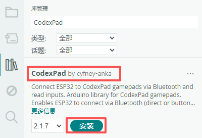
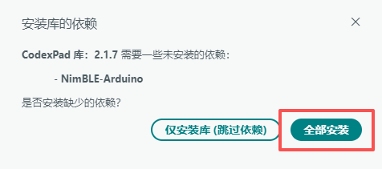

# CodexPad Arduino Lib

[English](README.md)

## 概述

本库为**CodexPad**系列手柄提供的 **Arduino 平台专用库**，支持ESP32系列开发板通过蓝牙连接并读取CodexPad手柄的所有按键与摇杆输入状态。关于 CodexPad 产品的详细信息，请查阅以下产品文档。

| CodexPad型号 | 详情 |
| :--- | :--- |
| CodexPad-C10 | [产品详情](../../../codex_pad_c10/blob/main/README.zh-CN.md#codexpad-c10) |
| CodexPad-S10 | [产品详情](../../../codex_pad_s10/blob/main/README.zh-CN.md#codexpad-s10) |

## 支持的硬件平台

| 支持的硬件平台 |
| :--- |
| ESP32 |
| ESP32-S2 |
| ESP32-S3 |
| ESP32-C3 |
| ESP32-C5 |
| ESP32-C6 |
| ESP32-H2 |
| ESP32-P4 |

## 特性

- **灵活的双模式连接**：

  - **Bluetooth Device Address直连**：通过已知的**Bluetooth Device Address**，快速与指定手柄建立稳定连接。

  - **按键掩码扫描连接**：无需提前知道**Bluetooth Device Address**。通过扫描并匹配目标手柄上被按住的、由用户代码自定义的按键组合（即“按钮掩码”），自动连接信号最强（RSSI最大）的设备，实现快速、灵活的配对。

- **实时按键事件检测**：可实时读取所有按键的输入状态，并区分**按下**、**释放**和**按住**三种事件。

- **高精度摇杆数据**：获取左右摇杆X轴和Y轴的模拟量数值，范围从0至255，提供精准的控制输入。

- **可调发射功率**：允许根据实际应用场景（如距离、功耗需求），在 **-16 dBm** 至 **+6 dBm** 范围内动态调整蓝牙发射功率。

## 按键掩码扫描连接功能详解

**按键掩码扫描连接**是CodexPad的一项特色功能，允许主机通过扫描并匹配设备上被按住的特定按键组合来进行连接。这种方式通过在设备与主机间建立一个物理“握手”协议，从而在多设备环境和灵活配对场景下具有显著优势。

### 设计意图与优势

1. **防止意外连接与干扰**：当周围存在多个可连接的同类设备（例如多个手柄）时，虽然通过其唯一的**Bluetooth Device Address**可以进行精确连接，但这通常需要在代码中“硬编码”该地址。这种方式将程序与特定设备绑定，缺乏灵活性。通过要求目标设备在被发现时必须同时按住一个特定的按键组合，相当于定义了一个动态的、基于条件的连接规则。您的连接代码无需绑定任何设备的物理地址，只要设备满足此“握手协议”（按住正确按键），就会被连接。这既有效避免了主机在多个设备中意外连接到非目标设备，又实现了**即按即连，设备可随时切换**的便捷性。

2. **构建专属连接条件**：你可以将此按键掩码视为一个简单的“密码”或“连接令牌”。它为你的应用程序和设备间构建了一个专属的连接通道，只有满足此特定物理交互条件（按下指定按键）的设备才能加入，增强了连接的意图性和可控性。

3. **提升代码灵活性，支持设备随时切换**：与在代码中硬编码特定设备的Bluetooth Device Address不同，使用按键掩码的连接逻辑是面向“条件”而非“特定设备”的。这意味着你的同一套连接代码，无需修改，即可用于连接任何处于可发现状态、并正确触发了预设按键条件的手柄。这带来了两大便利：

    - **无需绑定特定设备**：你无需在代码中指定某个手柄的地址，也无需为不同的手柄维护不同的连接配置。

    - **即按即连，灵活切换**：在实际使用中，你可以随时拿起另一个手柄，只要它开机并按住正确的按键组合，你的程序就能自动连接到它，实现了在不同手柄间的无缝切换。

## 使用说明

### 准备工作

在开始编程前，请完成以下准备工作，以确保开发过程顺利进行。

#### 熟悉产品文档

- 详细阅读 CodexPad 产品手册，全面了解硬件特性、熟悉手柄按键摇杆布局、功能定义、指示灯状态以及开关机操作等基本信息。

#### 获取并记录手柄**Bluetooth Device Address(BD_ADDR)**

> **⚠️ 重要提示**：本库直连的示例是通过 **Bluetooth Device Address(BD_ADDR)** 进行连接。**编程时，必须在代码明确指定您手柄的Bluetooth Device Address(BD_ADDR)。**

请参考产品手册中提供的方法，获取您手柄的**Bluetooth Device Address(BD_ADDR)**。其格式通常为 `"E4:66:E5:A2:24:5D"`（由0-9、A-F的字符组成，冒号为半角）。请妥善记录此信息，后续需要在代码为您自己手柄的实际**Bluetooth Device Address(BD_ADDR)**。

#### 开启手柄并进入待连接状态

- 将手柄开机，手柄开机后会自动处于蓝牙可被发现的**待连接状态**，此时手柄指示灯应呈现**慢闪状态（约每秒闪烁一次）**。

### 安装 ESP32 开发板管理器

1. 在 Arduino IDE 中，打开**工具** > **开发板** > **开发板管理器...**。
2. 在搜索框中输入 `esp32`，找到并安装 **ESP32 by Espressif Systems**。
3. 安装完成后，在**工具** > **开发板**列表中选择您使用的具体 ESP32 开发板型号（如 `ESP32 Dev Module`）。
4. 通过 USB 数据线将开发板连接至电脑，并在**工具** > **端口**菜单中选择正确的串行端口。

### 安装CodexPad库

1. **打开 Arduino IDE 库管理器**
   - 菜单栏：**工具** → **管理库...**
   - 快捷键：`Ctrl+Shift+I`（Windows/Linux）或 `Cmd+Shift+I`（Mac）

2. **搜索并安装**
   - 在搜索框中输入：`CodexPad`
   - 找到 CodexPad 库
   - **确保在下拉菜单中选择最新版本**
   - 点击 **安装** 按钮

    

    > **📌 注意：** 截图仅供参考。请务必安装最新可用版本。

3. **安装依赖库**
   - 当出现依赖库安装对话框时，选择 **全部安装**

    

> **⚠️ 重要版本说明**  
> 本文档中的截图可能显示较旧版本。**请始终安装以下两者的最新版本**：
>
> - `CodexPad` 库
> - `NimBLE-Arduino` 依赖库
>
> 如果您跳过了依赖库安装，请手动安装最新版 `NimBLE-Arduino`：
>
> 1. 再次打开库管理器
> 2. 搜索 `NimBLE-Arduino`
> 3. 在下拉菜单中**选择最新版本**
> 4. 点击安装

## 示例说明

### 基础轮询示例 (`basic_polling`)

- **示例位置**：在 Arduino IDE 中，通过 **文件** → **示例** → **CodexPad** → **basic_polling** 找到该示例。
- **示例说明**：通过Bluetooth Device Address与CodexPad蓝牙连接，实时查询、打印其所有按钮状态与摇杆数值。

### 输入状态检测示例 (`inputs_detection`)

- **示例位置**：在 Arduino IDE 中，通过 **文件** → **示例** → **CodexPad** → **inputs_detection** 找到该示例。
- **示例说明**：通过Bluetooth Device Address与CodexPad蓝牙连接，检测到按钮状态与摇杆数值变化后打印。

### 扫描连接示例 (`scan_and_connect`)

- **示例位置**：在 Arduino IDE 中，通过 **文件** → **示例** → **CodexPad** → **scan_and_connect** 找到该示例。
- **核心功能**：通过匹配特定的自定义的**按键**或者**按键组合**来扫描并自动连接附近的 CodexPad 设备，检测摇杆和按键变化并打印。
- **操作步骤**：代码启动后进入扫描连接状态，手柄开机后蓝灯闪烁，此时按住手柄上你代码中指定的按键掩码（按键组合）直到主机连接到手柄为止，之后正常操作手柄观察控制台的日志输出。
- **重要提示**：设置按钮掩码时，**请勿单独使用 `Home` 键**。长按 `Home` 键会导致手柄关机，从而中断连接。如确需使用 `Home` 键，请务必采用组合按键（如 `Home` + `Cross`）。

## API说明

详情链接：<https://codexpad.github.io/codex_pad_arduino_lib/html/zh-CN/annotated.html>

## 许可证

本项目采用 MIT 许可证 - 详见 [LICENSE](LICENSE) 文件。
