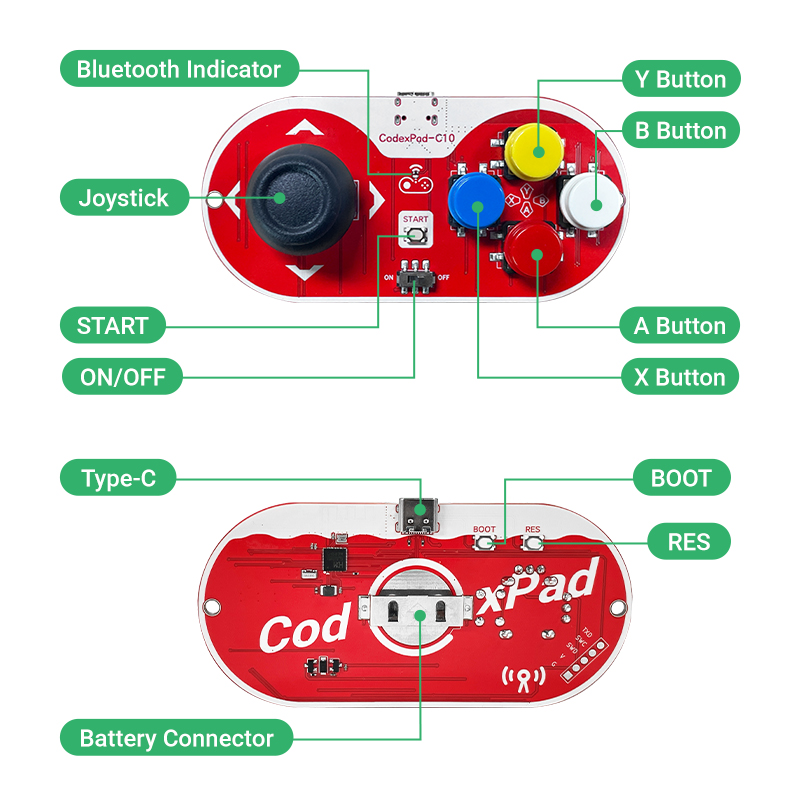
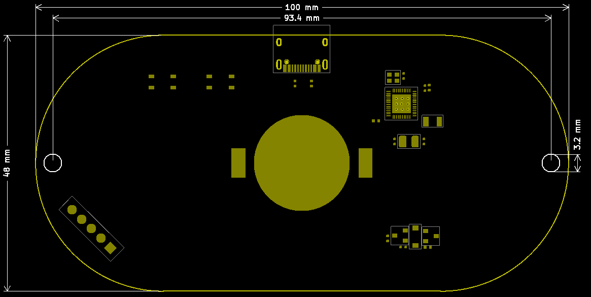
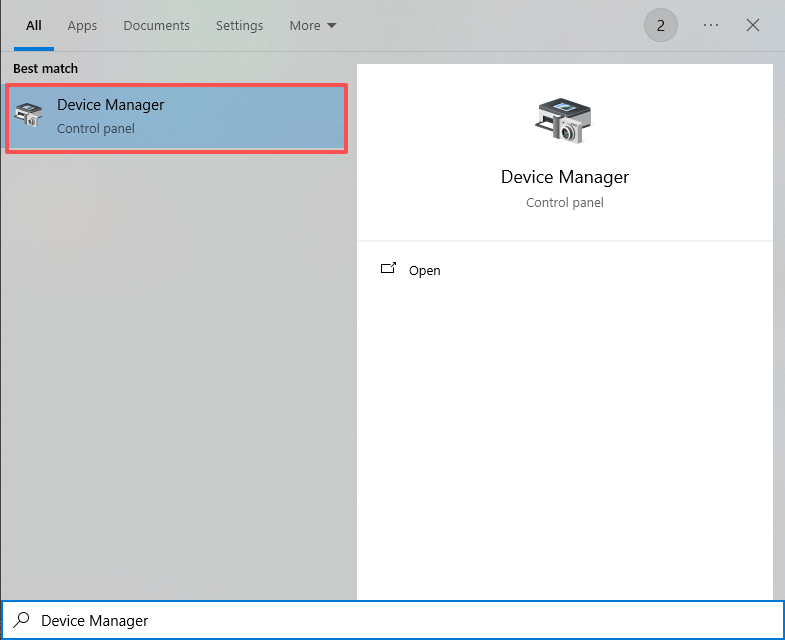
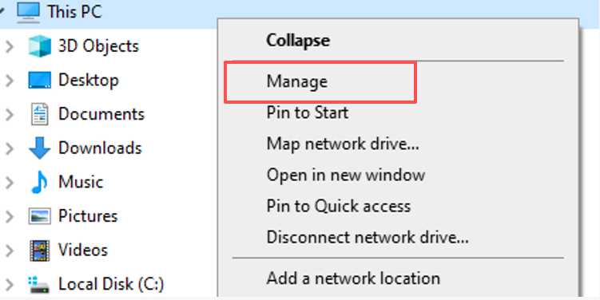
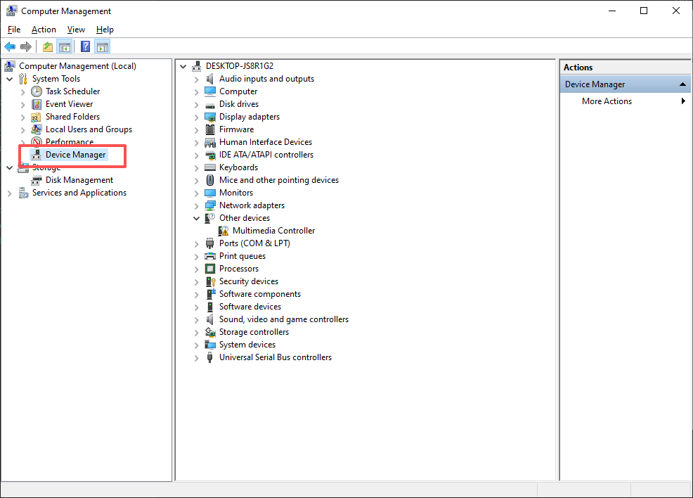
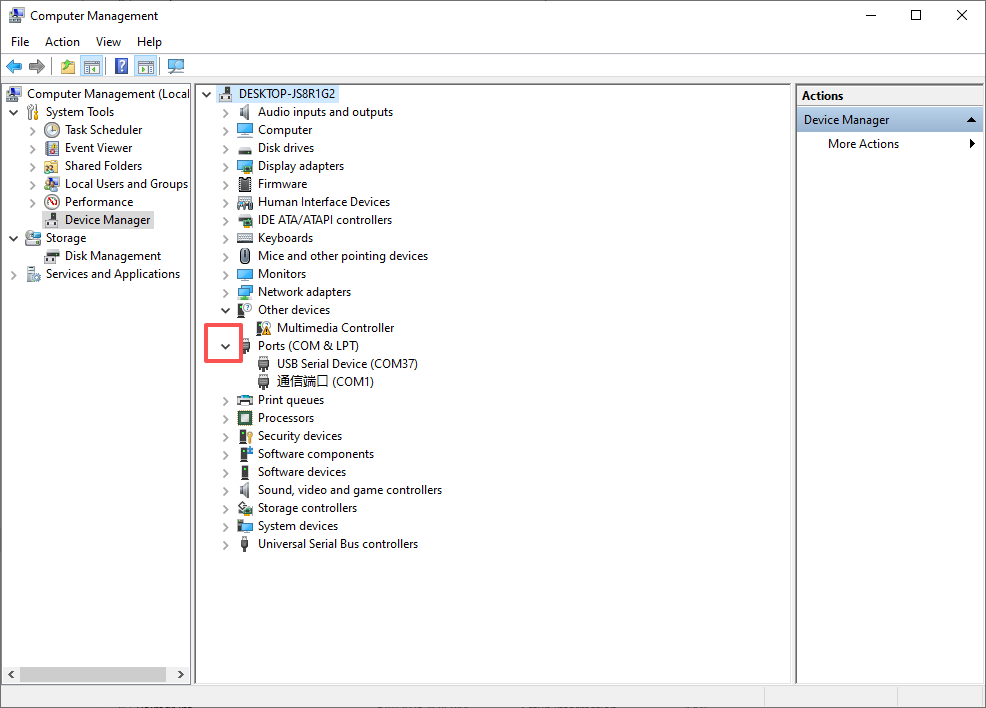
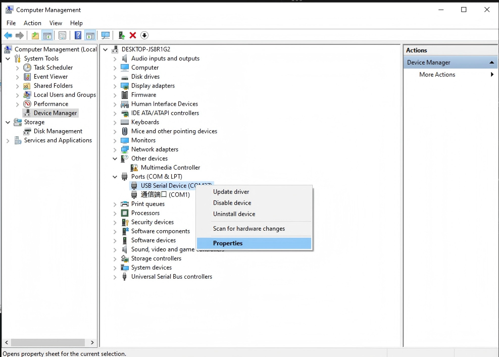
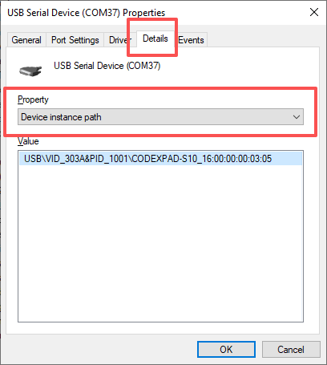
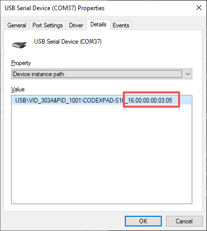

# CodexPad-C10

[中文](README.zh-CN.md)

## Overview

**CodexPad-C10** is a Bluetooth Low Energy controller from the CodexPad series, designed specifically for makers and embedded developers. Unlike conventional controllers that depend on an operating system’s Bluetooth stack, this product is **built for OS‑less hardware platforms**. It can establish peer‑to‑peer communication directly with bare‑metal BLE devices such as **ESP32**, **ESP32‑S**, **ESP32‑C**, **STM32**, **nRF**, **micro:bit**, **Raspberry Pi**, and similar boards — no operating system required. This makes it an out‑of‑the‑box remote physical input solution for robots, IoT devices, custom control panels, and more.

We provide a clean communication protocol, lightweight driver libraries, and a wide range of examples for supported platforms, so you can integrate the controller into your firmware quickly and focus on your core application.

---

## Product Appearance

---

## Product Component Diagram

## Specifications

- PCB thickness: 1.6mm  

- Product dimensions: 48*100mm

## Mechanical Dimension Drawing

<a href="assets/zip/codexpad_c10_3d.zip" download>Click to download 3D files</a>

## Input Device Specifications

- Number of buttons: 5  
- Number of joysticks: 1  
- Joystick type: dual‑axis analog  
- Joystick resolution: 8‑bit (0 – 255)

---

## Electrical Characteristics

- Operating voltage: 3.3V (coin cell battery)  
- Charging function: none  
- Battery life: approximately 2 hours under typical use  
- Battery type: CR2032

---

## Connectivity and Protocol

- Bluetooth version: Bluetooth Low Energy 5.3  
- Transmission distance: up to 50 m (open area)  
- Transmit power: **‑16 dBm** to **+6 dBm** (adjustable)  
- Communication protocol: open, lightweight binary protocol optimized for embedded systems  
- Supported role: BLE peripheral (slave)

---

## Installing the Battery

- Turn the power switch to `OFF` to cut off power and prevent short circuits or electrostatic damage during installation.

- Carefully remove the back cover of the controller to expose the circuit board and battery clip.

- Turn the controller over so the **back faces up**.

- Insert a CR2032 coin cell battery with the **positive side (“+” marking) facing up**. Align it with the battery clip and slide it in until it clicks securely into place and will not fall out.

---

## Installing the Shell

- Once the battery is installed, immediately put the back cover back on and secure it. This **prevents your hands from directly touching the rear circuitry**, reducing the risk of damage from static electricity or short circuits.

---

## Powering On and Off

- **Power on**: Set the power switch to `ON`. The LED indicator will begin to blink slowly and the device will start up.

- **Power off**: Set the power switch to `OFF`. The LED indicator will turn off and the device will shut down.

---

## LED Indicator Status

| LED Status | Meaning |
| :--- | :--- |
| Slow blinking (approx. 1 s on/off) | Powered on, advertising, and ready to connect |
| Fast blinking (approx. 100 ms on/off) | Low battery warning – replace the battery |
| Solid on | Powered on and successfully connected to a host device |
| Off | Powered off |

---

## Auto Power‑Off

To conserve battery power, controllers **V2.0 and above** will automatically shut down when a **broadcast timeout** occurs:

- **Broadcast timeout shutdown**: If the controller stays in the **slow blinking** state (advertising and waiting for a connection) for **more than 1 minute** after power‑on without being connected, it will power off automatically to maximise coin cell battery life. The LED turns off, and you will need to toggle the power switch to `OFF` and then back to `ON` to restart.

---

## Obtaining the Bluetooth Device Address (BD_ADDR)

When connecting to a CodexPad, you may need the device’s **unique** identifier: the **Bluetooth Device Address**. It acts like an “ID number” for the device, formatted as 12 hexadecimal characters separated by colons: `XX:XX:XX:XX:XX:XX` (where `X` is 0–9 or A–F), for example `E4:66:E5:A2:24:5D`.

### Method 1 (Recommended): Use the Metadata Access Feature

For detailed instructions, please refer to the [CodexPad Metadata Access Feature](../../../codex_pad_guide/blob/main/metadata.md#codexpad-metadata-access-function) documentation.

### Method 2: Use Device Manager on a Windows PC

1. Connect the CodexPad to your computer with a **USB data cable** and make sure the controller is **powered on**.

1. Open **Device Manager**

    - **Option 1**: Open the **Start** menu, type **Device Manager**, and select it from the search results.

        

    - **Option 2**: Open via **File Explorer**

        - Right‑click **This PC** and select **Manage**.

            

        - In the Computer Management window, select **Device Manager** from the left pane.

            

1. Expand the ports list

   - Click the **>** arrow next to **Ports (COM & LPT)** to expand the category.

        

1. Identify your controller

    - Look for one or more entries named **USB Serial Device (COMxx)**, where `xx` is a number.

    - **How to tell which one is your controller**: If more than one such device appears, **unplug the controller’s USB cable** and see which entry disappears. Then **plug it back in** — the entry that reappears is your controller. Note down its COM port number (e.g., COM172).

1. Open device properties

    - Right‑click the identified **USB Serial Device (COMxx)** and choose **Properties**.

        

1. View device details

    - In the properties window, go to the **Details** tab.

    - From the **Property** dropdown, select **Device instance path**.

        

1. Record the Bluetooth Device Address

    - The **Value** field will now display a string of information.

    - Find the part that contains **CODEXPAD-C10_** — the 12 colon‑separated characters that follow it (e.g. `E4:66:E5:A2:24:5D`) are your controller’s Bluetooth Device Address.

        

    - Carefully write down this address and keep it for future connections.

1. Disconnect the controller from the computer.

---

## Power Management

To preserve battery life and avoid unnecessary drain, **always turn the power switch to OFF** when the controller is not in use for an extended period. Even when no buttons are pressed, the BLE module keeps advertising at intervals to remain connectable, which consumes power continuously. Manually switching off is the most effective way to maximise coin cell battery life.

---

## USB Type‑C Interface Description

The USB Type‑C port on this controller serves two purposes: ① powering the controller circuitry and ② virtual serial port communication (e.g., for obtaining the Bluetooth Device Address). **Note:** this port **does not** support battery charging. If the controller is running on USB power and the cable is suddenly disconnected, it will instantly switch to the coin cell battery. If the battery is already low, its voltage may sag under the sudden load, which can trigger a reset and restart. This is a normal characteristic of the power‑switching process, not a malfunction. For reliable operation, ensure the battery has sufficient charge or keep the USB connection active.

---

## Installation and ESD Protection

To prevent irreversible damage from electrostatic discharge (ESD), **always make sure the outer shell is fully installed and secured before use**. When the rear circuit board is exposed, static electricity from your body or the environment can instantly destroy sensitive ICs through direct contact or nearby induction. The complete shell forms a vital physical barrier, keeping your hands away from the circuitry — a critical step in ensuring product reliability and long life.

---

## Connection and Usage Guide

| Hardware Platform Characteristics | Typical Representative Platforms | Documentation | Core Features |
| :--- | :--- | :--- | :--- |
| Main controller has built-in BLE capability or a BLE coprocessor, and the software can directly call low-level BLE APIs to connect to devices | <ul><li>ESP32</li><li>ESP32-S2</li><li>ESP32-S3</li><li>ESP32-C3</li><li>ESP32-C5</li><li>ESP32-C6</li><li>ESP32-H2</li><li>ESP32-P4</li><li>Raspberry Pi Pico W</li><li>Raspberry Pi Pico 2 W</li><li>micro:bit v2</li></ul> | [CodexPad Connection and Usage Guide: Using the Built-in BLE of Hardware Platforms](../../../codex_pad_guide/blob/main/connection_guide_native_ble.md#codexpad-connection-and-usage-guide-using-the-built-in-ble-of-hardware-platforms) | No external module required; libraries and examples provided for direct programming use |
| Main controller (e.g. STM32/Arduino) lacks Bluetooth and requires an external Bluetooth-to-Serial module (connected to TX/RX pins) | <ul><li>Arduino UNO + NL16</li><li>BLE UNO (same as Arduino UNO + NL16)</li><li>STM32 + HC05</li><li>Arduino UNO + HC05</li></ul> | [CodexPad Connection and Usage Guide: Using BLE to Serial Module](../../../codex_pad_guide/blob/main/connection_guide_ble_uart.md#codexpad-connection-and-usage-guide-using-ble-to-serial-module) | **Passthrough mode**; data forwarded via serial port |
| Main controller (e.g. STM32/Arduino) lacks Bluetooth and requires a CodexPad dedicated receiver on the I2C bus (under development) | Any hardware platform supporting I2C | [CodexPad Connection and Usage Guide: Using the Dedicated BLE to I2C Receiver](../../../codex_pad_guide/blob/main/connection_guide_i2c_receiver.md#connection_guide_i2c_receiver.md#codexpad-connection-and-usage-guide-using-the-dedicated-ble-to-i2c-receiver) | |

---

## Important Notes

[Important Notes](../../../codex_pad_guide/blob/main/notice.md#important-notes)
