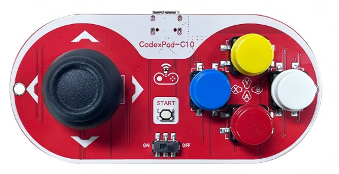
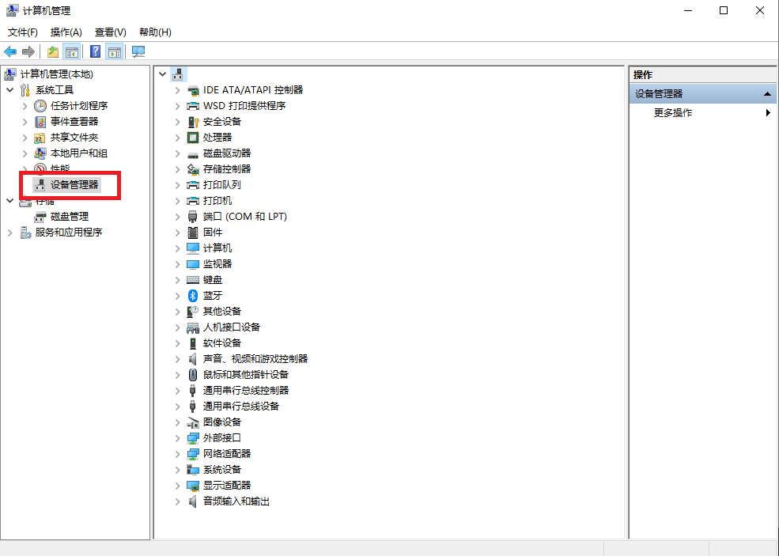
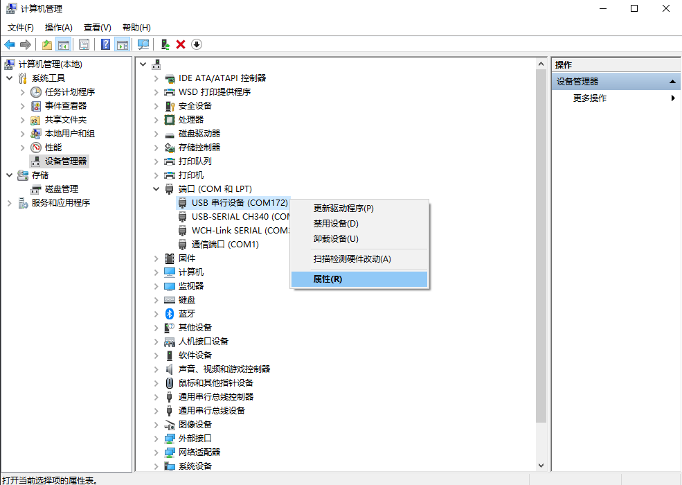
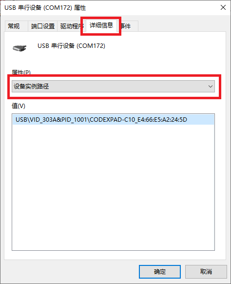

# CodexPad-C10

[English](README.md)

## 概述

**CodexPad-C10​** 是 CodexPad 系列中专为创客与嵌入式开发者设计的低功耗蓝牙手柄。与市面上依赖操作系统蓝牙协议栈的通用手柄不同，本产品**专为无操作系统的硬件平台打造**，无需系统层支持，即可直接与裸机运行的低功耗蓝牙硬件平台（如 **ESP32** 系列、**ESP32-S** 系列、**ESP32-C** 系列、**STM32** 系列、**nRF** 系列、 **micro:bit**、**树莓派**系列等）进行对等通信，为机器人、物联网设备、自定义控制面板等提供了即插即用的远程物理输入解决方案。

我们为适配的硬件平台提供了简洁的通信协议、轻量级驱动库与丰富示例，让开发者能快速将手柄集成到固件中，专注于核心功能的实现。

---

## 产品外观图

---

## 产品部件示意图

## 规格参数

- PCB厚度：1.6mm

- 产品尺寸：48*100mm

## 机械尺寸图

<a href="assets/zip/codexpad_c10_3d.zip" download>点击下载3D文件</a>

## 输入设备规格

- 按键数量：5
- 摇杆数量：1
- 摇杆类型：双轴模拟摇杆
- 摇杆分辨率：8位（0 ~ 255）

---

## 电气特性

- 工作电压：​3.3V (纽扣电池)
- 充电功能：无
- 续航时间：典型使用下约2小时
- 电池类型：CR2032

---

## 连接性与协议

- 蓝牙版本：Bluetooth Low Energy 5.3
- 传输距离：50m (开阔环境)
- 发射功率：**-16 dBm** 到 **+6 dBm** （可调）
- 通信协议：开放的、专为嵌入式优化的轻量级二进制协议
- 支持角色：BLE外设设备（从机）

---

## 安装电池

- 将手柄电源开关拨动至`OFF​`端关闭电源，切断电路，防止安装过程中发生短路或静电损坏器件

- 小心剥离手柄背部外壳，露出背部电路板和电池扣插件

- 将手柄翻转至**背部朝上**

- 将CR2032纽扣电池**正极（"+"标识面）朝上**，平行于电池扣中间间隙，平滑推入，确保牢固卡住、不会脱落

---

## 安装外壳

- 电池安装完毕后，立即将外壳装回并固定好，这样**避免手直接触碰背部电路，防止因静电或短路导致器件损坏**

---

## 开机与关机

- **开机**：将手柄电源开关拨动至`ON`端打开电源，指示灯开始慢闪，设备启动。

- **关机**：将手柄电源开关拨动至`OFF`端关闭电源，指示灯熄灭，设备关机。

---

## 指示灯状态说明

| 指示灯状态 | 设备状态含义 |
| :--- | :--- |
| 慢闪 （约1秒亮/灭） | 已开机，正在广播信号，可被连接 |
| 快闪 （约100毫秒亮/灭） | 低电量警告。电池电量已不足，无法正常工作，请更换电池 |
| 常亮 | 已开机，已成功连接到主机设备 |
| 熄灭 | 已关机 |

---

## 自动关机说明

为节省电池电量，手柄**V2.0及以上版本**会在**广播超时**后自动进入关机状态：

- **广播超时关机**：手柄开机后，若持续处于**慢闪**（广播等待连接）状态**超过1分钟**仍未与任何设备建立连接，为最大限度延长纽扣电池使用寿命，手柄将自动关机。此时指示灯熄灭，需要将电源开关拨动至`OFF`再拨回`ON`才能重新开机。

---

## 获取Bluetooth Device Address(BD_ADDR)

在与CodexPad连接时，可能需要使用到设备的**唯一**标识：**Bluetooth Device Address**。它如同设备的“身份证号”，由12位十六进制字符组成，以冒号分隔，格式为`XX:XX:XX:XX:XX:XX`（其中`X`为 0-9 或 A-F），例如：`E4:66:E5:A2:24:5D`。

### 获取方法一(推荐)：通过元数据访问功能获取

详细操作方法请参阅 [CodexPad元数据访问功能](../../../codex_pad_guide/blob/main/metadata.zh-CN.md#codexpad元数据访问功能) 文档。

### 获取方式二：通过Windows电脑的设备管理器获取

1. 使用**数据线**将CodexPad与电脑连接，并将CodexPad置于**开机**状态

1. 启动“**设备管理器**”

    - **启动方式1**：启动 “**开始**”菜单，输入 “**设备管理器**”。 然后，从搜索结果中选择“**设备管理器**”点击启动

        

    - **启动方式2**：通过“**文件资源管理器**”启动

        - 在文件资源管理器中，右键单击“**此电脑**”，选择“**管理**”

            

        - 然后从生成的对话框中列出的系统工具中选择 “**设备管理器**”

            

1. 展开端口列表

   - 在设备管理器的设备列表中，找到并点击“**端口（COM和LPT）**”类别左侧的 “**>**” 符号，将其展开

        

1. 识别您的手柄设备

    - 在展开的列表中，您会看到一个或多个名为“**USB 串行设备 (COMxx)**”的条目，其中xx代表数字

    - **如何确认哪个是手柄**：如果列表中有多个此类设备，您可以**拔掉手柄的USB线**，观察列表中哪个“USB 串行设备”条目消失；**重新插上手柄**，观察哪个新出现的条目，该条目即对应您的手柄。请记下其COM口号（例如：COM172）

1. 打开设备属性

    - 右键点击您所识别出的“**USB 串行设备 (COMxx)**”，在弹出的菜单中选择“**属性**”

        

1. 查看设备详细信息

    - 在弹出的属性窗口中，点击顶部的“**详细信息**”选项卡

    - 在“**属性(P)**”下方的下拉菜单中，选择“**设备实例路径**”

        

1. 记录Bluetooth Device Address

    - 此时，“**值(V)**”下方的文本框中将显示一串信息

    - 在这串信息中，找到“**CODEXPAD-C10_**”字段，其后面紧跟的由冒号分隔的12位字符（例如：`E4:66:E5:A2:24:5D`）即为您手柄的Bluetooth Device Address

        

    - 请准确抄录这串Bluetooth Device Address并妥善保管，用于后续连接

1. 断开手柄与电脑的连接

---

## 电源管理

为确保产品续航并避免不必要的电量损耗，当您长时间不使用手柄时，**请务必将手柄的电源开关拨动至 OFF位置**切断电源。在电源开启 (ON) 状态下，即使没有进行任何按键操作，手柄为保持可被连接状态，其低功耗蓝牙 (BLE) 模块仍会以一定间隔进行广播，这个过程会产生持续电流消耗。主动关机是最大限度延长纽扣电池使用寿命的最有效方式。

---

## USB Type-C 接口说明

本手柄的 USB Type-C 接口主要用于 ① 为手柄电路供电​ 和 ② 虚拟串口通信（如用于获取Bluetooth Device Address）。需要特别注意的是，此接口不具备电池充电功能。当手柄通过 USB 线缆供电运行时，若突然拔下线缆，系统会瞬间切换至纽扣电池供电。如果纽扣电池电量已处于较低水平，其电压在负载突然加大的瞬间可能无法及时响应，导致电压骤降而引发系统复位重启。此现象属于电源切换过程中的正常特性，并非设备故障。建议在需稳定使用的场景下，确保使用电量充足的电池或保持 USB 供电连接。

---

## 安装与静电防护

为防止静电放电 (ESD) 对精密电子元件造成不可逆的损伤，**在使用手柄前，必须确保其外部外壳已完全安装并紧固**。手柄背部的电路板直接暴露在外时，人体或环境产生的静电可能通过直接接触或近距离感应，瞬间击穿脆弱的集成电路，这种损伤通常是永久性的。完整的外壳构成了重要的物理屏障，能有效避免手部直接接触电路，是保证产品可靠性和使用寿命的关键步骤。

---

## 连接使用指南

| 硬件平台特征 | 典型代表平台 | 文档 | 核心特点 |
| :--- | :--- | :--- | :--- |
| 主控自带BLE功能或者有BLE协处理器，同时，软件可以自己调用底层BLE API进行设备连接 | <ul><li>ESP32</li><li>ESP32-S2</li><li>ESP32-S3</li><li>ESP32-C3</li><li>ESP32-C5</li><li>ESP32-C6</li><li>ESP32-H2</li><li>ESP32-P4</li><li>Raspberry Pi Pico W</li><li>Raspberry Pi Pico 2 W</li><li>micro:bit v2</li></ul> | [CodexPad连接使用指南：使用硬件平台内置BLE](../../../codex_pad_guide/blob/main/connection_guide_native_ble.zh-CN.md#codexpad连接使用指南使用硬件平台内置ble) | 无需外接模块，提供了库和示例，直接编程使用 |
| 主控（如 STM32/Arduino）没有蓝牙，需要外接蓝牙转串口模块（插在 TX/RX 引脚上） | <ul><li>Arduino UNO + NL16</li><li>BLE UNO(同Arduino UNO + NL16)</li><li>STM32 + HC05</li><li>Arduino UNO + HC05</li></ul> | [CodexPad连接使用指南：使用BLE转串口模块](../../../codex_pad_guide/blob/main/connection_guide_ble_uart.zh-CN.md#codexpad连接使用指南使用ble转串口模块) | **透传模式**，数据通过串口转发 |
| 主控（如 STM32/Arduino）没有蓝牙，需要在I2C总线上外接CodexPad专用接收器（开发中） | 任意支持I2C的硬件平台 | [CodexPad连接使用指南：使用专用的BLE转I2C接收器](../../../codex_pad_guide/blob/main/connection_guide_i2c_receiver.zh-CN.md#codexpad连接使用指南使用专用的ble转i2c接收器) | |

---

## 注意事项

[注意事项](../../../codex_pad_guide/blob/main/notice.zh-CN.md#注意事项)
