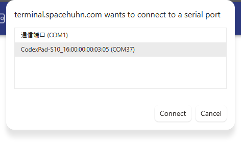
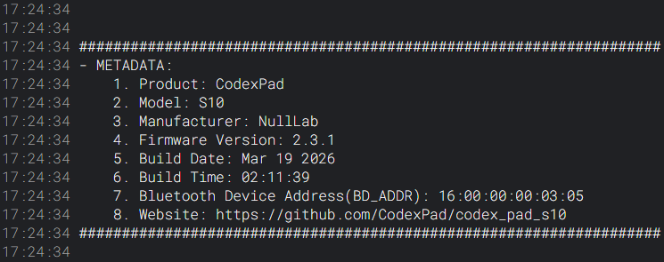
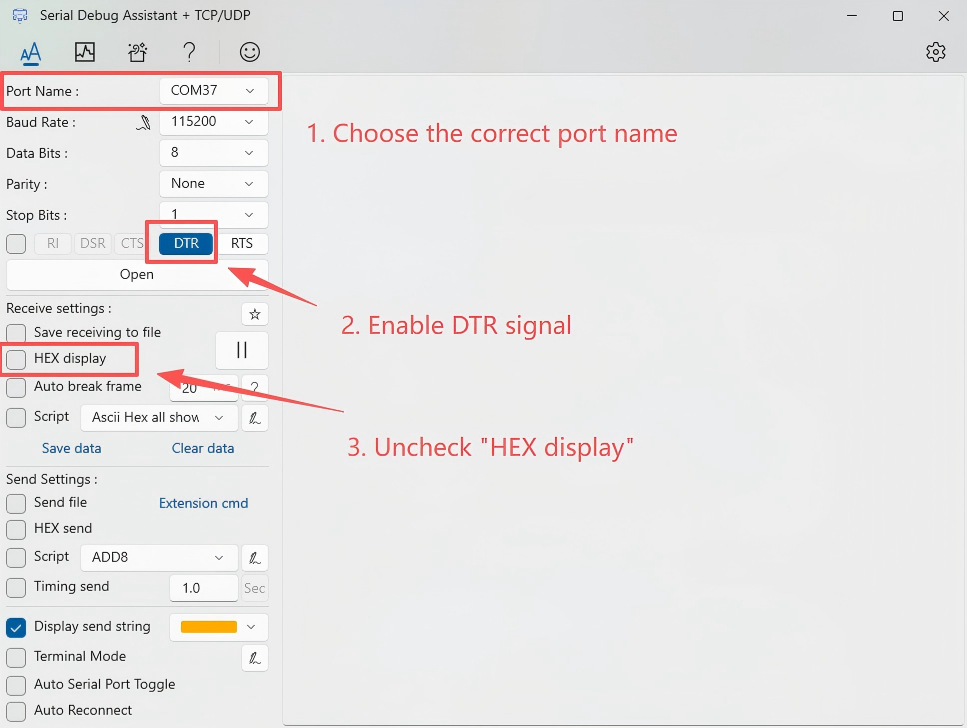
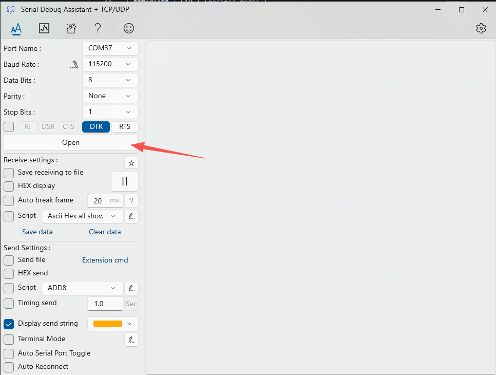
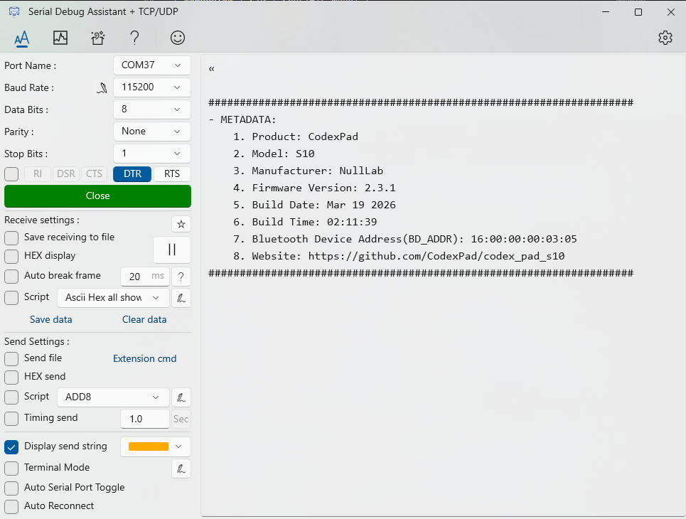

# CodexPad Metadata Access Function

## Overview

The metadata function is used to obtain **the product's Bluetooth Device Address, firmware version, hardware information, and more**.

## Usage Scenarios

1. **Read Bluetooth Device Address**: Used for pairing and connection, and also convenient for developers to confirm which specific gamepad is currently communicating when multiple devices are connected.
2. **Quick diagnosis**: When seeking technical support, you can quickly provide accurate information such as the firmware version to help resolve issues.
3. **Product authenticity and information verification**: Users can verify the basic information of the product themselves.

## Working Principle

When the controller is connected to the computer using a USB data cable when powered on, it will be simulated as a standard serial port (COM Port) and automatically print out the complete device metadata in the terminal.

**Communication parameters and process:**

- **Universality**: Any serial terminal tool (web-based, Windows, macOS, Linux) can be used after proper configuration.
- **Key configuration**: The baud rate can be set to any value, but **you must enable the DTR signal**. Some tools may require you to manually enable this option.
- **Auto-response**: After a successful connection, the gamepad automatically reports the metadata.

## Output Example

```log
- METADATA:
    1. Product: CodexPad
    2. Model: S10
    3. Manufacturer: NullLab
    4. Firmware Version: 2.3.1
    5. Build Date: Mar 19 2026
    6. Build Time: 02:11:39
    7. Bluetooth Device Address(BD_ADDR): 0C:3D:5E:A4:5E:6B
    8. Website: https://github.com/CodexPad/codex_pad_s10
```

## Detailed Metadata Information

The information output by the gamepad is clearly formatted and includes the following fields:

| Field | Example Value | Description |
| :--- | :--- | :--- |
| **Product** | CodexPad | Product name |
| **Model** | S10 | Specific model |
| **Manufacturer** | NullLab | Manufacturer |
| **Firmware Version** | 2.3.1 | Firmware version number |
| **Build Date** | Mar 19 2026 | Firmware compilation date |
| **Build Time** | 02:11:39 | Firmware compilation time |
| **Bluetooth Device Address(BD_ADDR)** | 0C:3D:5E:A4:5E:6B | Used for pairing and connection |
| **Website** | <https://github.com/CodexPad/codex_pad_s10> | Product documentation (international version) |

## Access Methods

### Universal Connection Logic

Regardless of which tool you use below, successfully connecting and accessing metadata generally follows these steps:

1. Connect and power on:

    - Connect the controller to your computer using a USB cable.
    - Ensure the controller is powered on:

        - For models with a physical master switch, manually turn on the switch.
        - You can determine if it is powered on by observing whether the controller's indicator light (if available) is lit.

2. Identify the port: Locate the newly appeared serial port in your operating system (e.g., COMx, ttyACM0, etc.).

3. Configure the tool

    - Key step: **Make sure to enable the DTR signal**.
    - Baud rate: Can be set to any value (e.g., 9600, 115200), and typically does not affect communication.
    - Other parameters usually remain at their defaults (data bits: 8, stop bits: 1, parity: none).

4. Establish the connection: Click "Open" or "Connect". Upon success, the controller will automatically report the metadata once.

### Method 1: Using the Web Serial Terminal

1. Ensure the controller is **powered on** and connected to the computer via USB.

2. Open your browser and visit: <https://terminal.spacehuhn.com/>

3. Click the **CONNECT** icon in the middle of the screen.

4. In the device list that pops up, select the device starting with `CodexPad`, then click **Connect**.

    

5. After a successful connection, the content area will print the metadata information, as shown in the image below:
s
    

### Method 2: Using Windows Serial Debug Assistant

1. Install the Serial Debug Assistant

    - Visit the Serial Debug Assistant download page: <https://apps.microsoft.com/detail/9nblggh43hdm?launch=true&hl=en-gb&gl=cn>

    - Download and install the latest version suitable for Windows yourself.

2. Launch the Serial Debug Assistant

    - After installation, find and launch the program from the desktop or Start menu.

3. Configure the serial connection

    - Select the correct COM port

        - Ensure the controller is **powered on** and connected to the computer via USB.

        - In the "**Port Name**" dropdown menu in the software interface, select the corresponding COM port (e.g., `COM172`).

        - **How to identify which port is the controller**: If you cannot determine which port corresponds to the controller, you can **unplug the controller's USB cable** and observe which port disappears from the list. Then **plug the controller back in** and see which new port appears; that port corresponds to your controller.

    - Configure serial port parameters

        - **Baud Rate**: Can be set to any value (e.g., 9600, 115200, etc.)

        - **Data Bits**: 8

        - **Stop Bits**: 1

        - **Parity**: None

        - **Receive display**: Ensure the "Hex display" option is unchecked so that you can view the metadata in text format.

    - Enable the DTR signal

        - Locate the "**DTR**" option in the software interface and click to enable it; the option will turn green.

    

4. Establish the connection

    - After completing the above configuration, click the "**Open**" button to establish the connection.

        

    - After a successful connection, the controller will automatically send the device metadata once, which will be displayed in the "**Receive Area**" on the right side of the software, as shown in the image below:

        
