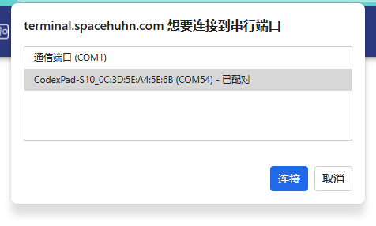
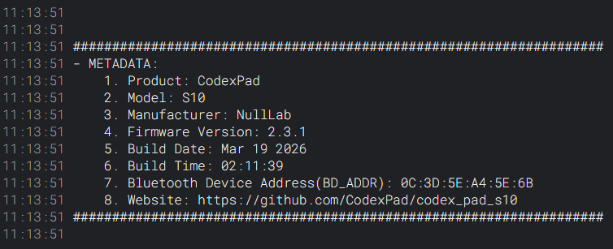
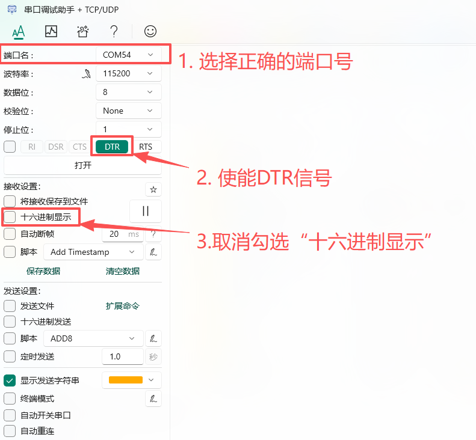
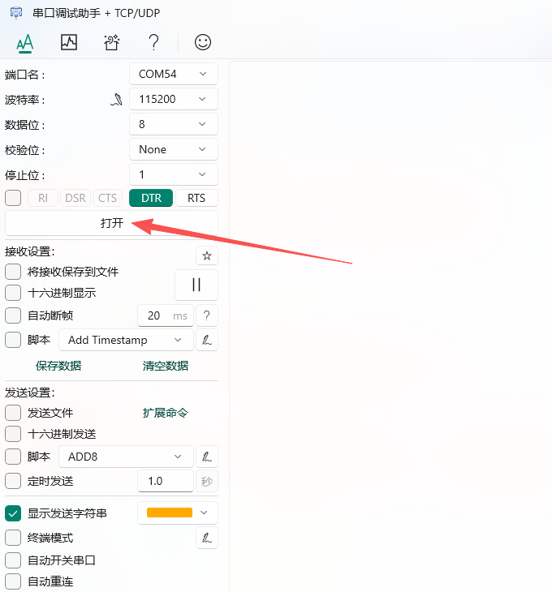
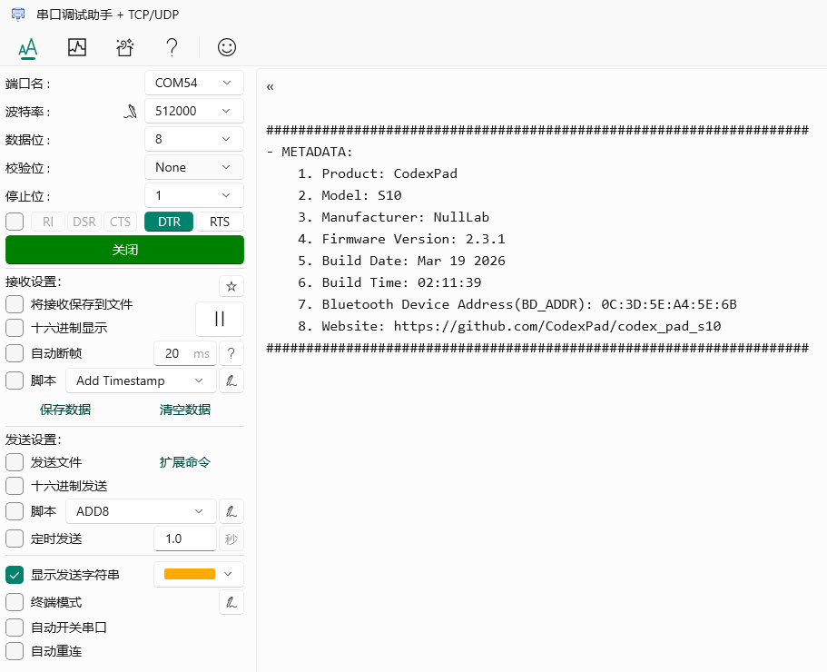

# CodexPad元数据访问功能

## 概述

元数据的功能用于获取**产品的Bluetooth Device Address、固件版本及硬件等信息**。

## 使用场景

1. **读取Bluetooth Device Address**：用于配对连接，同时也方便开发者在连接多个设备时，确认当前通信的是哪个具体手柄。
2. **快速诊断**：在寻求技术支持时，可以快速提供准确的固件版本等信息，帮助解决问题。
3. **产品真伪与信息核实**：用户可自行核实产品的基本信息。

## 工作原理

手柄在开机的情况下使用USB数据线将手柄连接到电脑时，它会被`模拟成一个标准的串行端口（COM Port）`，并自动在终端中打印出完整的设备元数据。

**通信参数与流程：**

- **通用性**：任何串口工具（网页版、Windows、macOS、Linux）在正确配置后均可使用
- **关键配置**：波特率可任意设置，但**务必使能DTR信号**，部分工具可能需要手动启用此选项。
- **自动应答**：连接成功后，手柄自动上报元数据

## 输出示例

```log
- METADATA:
    1. Product: CodexPad
    2. Model: S10
    3. Manufacturer: NullLab
    4. Firmware Version: 2.3.1
    5. Build Date: Mar 19 2026
    6. Build Time: 02:11:39
    7. Bluetooth Device Address(BD_ADDR): 0C:3D:5E:A4:5E:6B
    8. Website: https://github.com/CodexPad/codex_pad_s10
```

## 元数据信息详解

手柄输出的信息格式清晰，包含以下字段：

| 字段 | 示例值 | 说明 |
| :--- | :--- | :--- |
| **Product** | CodexPad | 产品名称 |
| **Model** | S10 | 具体型号 |
| **Manufacturer** | NullLab | 制造商 |
| **Firmware Version** | 2.3.1 | 固件版本号 |
| **Build Date** | Mar 19 2026 | 固件编译日期 |
| **Build Time** | 02:11:39 | 固件编译时间 |
| **Bluetooth Device Address(BD_ADDR)** | 0C:3D:5E:A4:5E:6B | 用于配对连接 |
| **Website** | <https://github.com/CodexPad/codex_pad_s10> | 产品文档（国际版） |

## 访问方法

### 通用连接逻辑

无论使用以下哪种工具，成功连接并访问元数据通常遵循以下步骤：

1. 连接与上电：

    - 用USB线将手柄连接至电脑。
    - 确保手柄已上电：

        - 对于有物理总开关的型号，请手动打开开关。
        - 您可以通过观察手柄的指示灯（如有）是否亮起来判断是否已上电。

2. 识别端口：在操作系统中找到新出现的串行端口（如 COMx， ttyACM0等）。

3. 配置工具

    - 关键步骤：**务必启用DTR信号**。
    - 波特率：可设置为任意值（如9600、115200），通常不影响通信。
    - 其他参数通常保持默认（数据位8，停止位1，校验位无）。

4. 建立连接：点击“打开”或“连接”。成功后，手柄将自动上报一次元数据。

### 方法一：使用网页串口工具

1. 确保手柄已**开机**并已通过USB连接到电脑

2. 打开浏览器访问：<https://terminal.spacehuhn.com/>

3. 点击屏幕中间的**CONNECT**图标

4. 在弹出的设备列表中，选择以`CodexPad`开头的设备，然后点击**连接**

    

5. 连接成功后，内容框会打印元数据信息，如下图所示：

    

### 方法二：使用Windows串口调试助手

1. 安装串口调试助手

    - 访问串口调试助手下载页面：<https://apps.microsoft.com/detail/9nblggh43hdm?launch=true&hl=zh-cn&gl=cn>

    - 自行下载安装适用于Windows的最新版本

2. 启动串口调试助手

    - 安装完成后在桌面或开始菜单找到并启动程序

3. 配置串口连接

    - 选择正确的COM端口

        - 确保手柄已**开机**并已通过USB连接到电脑

        - 在软件界面的“**端口名**”下拉菜单中，选择对应的COM端口（例如`COM172`）

        - **如何确认哪个是手柄**：如果无法确定哪个端口对应手柄，您可以**拔掉手柄的USB线**，观察列表中哪个端口消失，**重新插上手柄**，观察哪个新出现的端口，该端口即对应您的手柄

    - 配置串口参数

        - **波特率**：可设置为任意值（如9600、115200等）

        - **数据位**：8

        - **停止位**：1

        - **校验位**：None (无)

        - **接收显示**：确保“十六进制显示”选项未勾选，以便查看文本格式的元数据

    - 启用DTR信号

        - 在软件界面中找到“**DTR**”选项，并点击启用它，选项会变为绿色

    

4. 建立连接

    - 完成上述配置后，点击“**打开**”按钮建立连接

        

    - 连接成功后，手柄会自动发送一次设备元数据，并显示在软件右侧的“**接收区**”，如下图所示：

        
